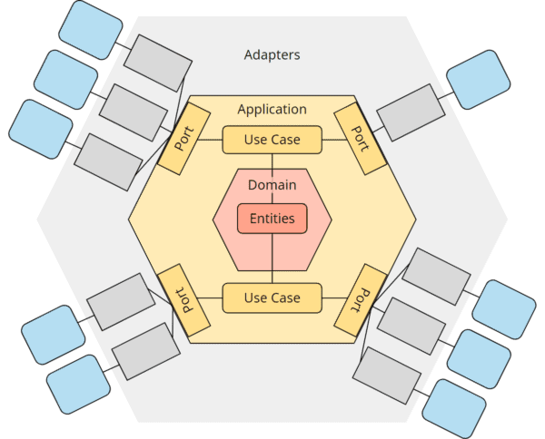
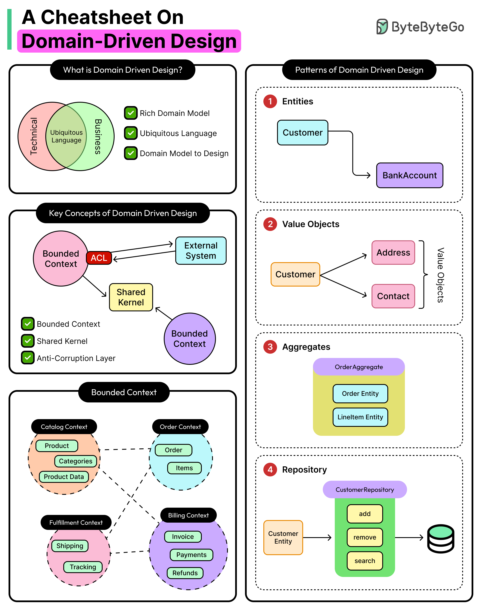
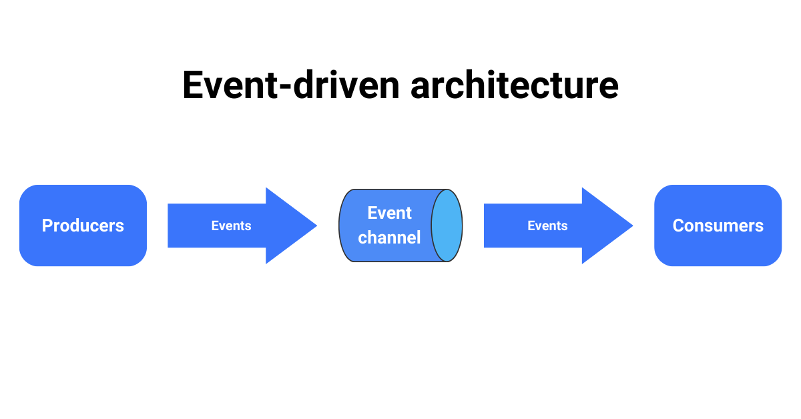
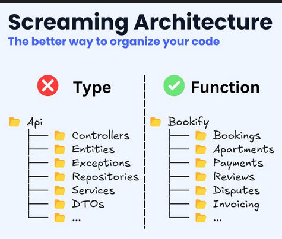

# 🎰 AI Poker - Texas Hold'em Server

[](https://openjdk.java.net/)
[](https://maven.apache.org/)
[](https://jakarta.ee/)
[](./target/surefire-reports/)
[](./target/site/jacoco/)

A professional **Texas Hold'em Poker Server** built with modern software architecture principles and real-time WebSocket communication. This project demonstrates enterprise-level Java development with **Hexagonal Architecture**, **Domain-Driven Design**, and **Event-Driven Architecture**.

## 📋 Table of Contents

- [Features](#-features)
- [Architecture Overview](#-architecture-overview)
- [Tech Stack](#-tech-stack)
- [Project Structure](#-project-structure)
- [Getting Started](#-getting-started)
- [Running Tests](#-running-tests)
- [API Documentation](#-api-documentation)
- [Code Examples](#-code-examples)

---

## ✨ Features

### Core Game Mechanics
- ✅ **Full Texas Hold'em Implementation** - Complete poker game logic with all betting rounds
- ♠️ **Hand Evaluation System** - Accurate poker hand ranking (Royal Flush, Straight Flush, etc.)
- 🎲 **Automatic Game Progression** - PRE_FLOP → FLOP → TURN → RIVER → SHOWDOWN
- 💰 **Betting Actions** - CHECK, CALL, RAISE, FOLD, ALL_IN
- 👥 **Multi-Player Support** - 2-9 players per table
- 🏆 **Winner Determination** - Automatic showdown and pot distribution

### Real-Time Features
- 🔄 **WebSocket Communication** - Real-time game state updates
- 📡 **Event-Driven Architecture** - Pub/Sub pattern for game events
- 🎯 **Targeted Events** - Private player cards, public game state
- ⚡ **Low Latency** - Sub-100ms response times

### Technical Excellence
- 🏗️ **Hexagonal Architecture** - Clean separation of concerns
- 📐 **Domain-Driven Design** - Rich domain model with ubiquitous language
- 🔊 **Event Sourcing Ready** - Complete event tracking
- 🧪 **High Test Coverage** - 64 comprehensive tests (85%+ coverage)
- 🗄️ **SQLite Persistence** - Game state and player data
- 🔒 **Type-Safe** - Strong typing with Value Objects

---

## 🏛️ Architecture Overview

This project implements **multiple architectural patterns** working together to create a maintainable, scalable, and testable system.

### Hexagonal Architecture (Ports & Adapters)



The application core is isolated from external concerns:

```
┌──────────────────────────────────────────────┐
│           Application Core                    │
│  ┌────────────────────────────────────┐      │
│  │      Domain Layer                  │      │
│  │  • Entities (Game, Player, Deck)   │      │
│  │  • Value Objects (PlayerId, Chips) │      │
│  │  • Domain Services                 │      │
│  │  • Business Rules                  │      │
│  └────────────────────────────────────┘      │
│  ┌────────────────────────────────────┐      │
│  │      Application Layer             │      │
│  │  • Use Cases (StartGame, Bet)      │      │
│  │  • DTOs                            │      │
│  │  • Ports (Interfaces)              │      │
│  └────────────────────────────────────┘      │
└──────────────────────────────────────────────┘
           ↑                    ↑
           │ Ports              │ Ports
           ↓                    ↓
┌─────────────────┐    ┌─────────────────┐
│  Infrastructure │    │  Infrastructure │
│   (Adapters)    │    │   (Adapters)    │
│  • WebSocket    │    │  • SQLite       │
│  • HTTP         │    │  • Event Bus    │
└─────────────────┘    └─────────────────┘
```

**Key Benefits:**
- ✅ Business logic independent of frameworks
- ✅ Easy to test (mock adapters)
- ✅ Flexible infrastructure changes
- ✅ Clear dependencies (always inward)

### Domain-Driven Design (DDD)



**Strategic Design:**
- **Bounded Contexts:** Game, Player, Lobby, Shared
- **Ubiquitous Language:** Poker terminology throughout code
- **Aggregates:** Game (root), Player, Round

**Tactical Patterns:**
- **Entities:** `Game`, `Player`, `Deck`
- **Value Objects:** `PlayerId`, `Chips`, `Card`, `GameId`
- **Domain Events:** `GameStartedEvent`, `PlayerActionEvent`
- **Repositories:** `GameRepository`, `PlayerRepository`
- **Domain Services:** `HandEvaluationStrategy`, `BettingRound`

### Event-Driven Architecture



**Event Flow:**
```
Player Action → Use Case → Domain Event → Event Publisher → WebSocket → All Clients
```

**Event Types:**
1. **Domain Events** - Business logic changes
   - `GAME_STARTED`, `PLAYER_ACTION`, `GAME_STATE_CHANGED`
2. **Integration Events** - Cross-boundary communication
   - `PLAYER_JOINED_LOBBY`, `ROUND_COMPLETED`
3. **Private Events** - Player-specific data
   - `PLAYER_CARDS_DEALT` (only to specific player)

### Screaming Architecture



The folder structure **screams "This is a Poker application!"**:

```
com.poker/
├── game/           ← "This handles poker games!"
├── player/         ← "This manages players!"
├── lobby/          ← "This handles lobbies!"
└── shared/         ← "Common utilities"
```

**Not**: `controllers/`, `services/`, `models/` (framework-centric)  
**But**: `game/`, `player/`, `lobby/` (business-centric)

For detailed architecture documentation, see **[ARCHITECTURE.md](./ARCHITECTURE.md)**.

---

## 🛠️ Tech Stack

### Backend (Java)
| Technology | Version | Purpose |
|------------|---------|---------|
| Java | 21 | Core language with latest features |
| Maven | 3.9+ | Build automation & dependency management |
| Jakarta WebSocket | 2.1.1 | Real-time bidirectional communication |
| Tyrus | 2.1.5 | WebSocket server implementation |
| SQLite | 3.44.1 | Embedded database |
| Gson | 2.10.1 | JSON serialization |
| JUnit Jupiter | 5.10.1 | Unit & integration testing |
| JaCoCo | 0.8.14 | Code coverage analysis |

### Frontend (Next.js)
See [client/poker-nextjs/README.md](./client/poker-nextjs/README.md)

---

## 📁 Project Structure

```
multiplayer-poker-texas-holdem/
├── src/main/java/com/poker/
│   ├── game/                          # Game Bounded Context
│   │   ├── domain/
│   │   │   ├── model/                 # Entities & Value Objects
│   │   │   │   ├── Game.java          # Aggregate Root
│   │   │   │   ├── Player.java        # Entity
│   │   │   │   ├── Deck.java
│   │   │   │   ├── Card.java          # Value Object
│   │   │   │   └── Round.java
│   │   │   ├── repository/            # Repository Port
│   │   │   ├── events/                # Domain Events
│   │   │   └── evaluation/            # Domain Services
│   │   ├── application/               # Use Cases
│   │   │   ├── StartGameUseCase.java
│   │   │   ├── PlayerActionUseCase.java
│   │   │   └── dto/                   # Data Transfer Objects
│   │   └── infrastructure/            # Adapters
│   │       └── persistence/
│   │
│   ├── player/                        # Player Bounded Context
│   ├── lobby/                         # Lobby Bounded Context
│   ├── shared/                        # Shared Kernel
│   │   ├── domain/
│   │   │   └── events/
│   │   │       ├── DomainEvent.java
│   │   │       └── DomainEventPublisher.java (Port)
│   │   └── infrastructure/
│   │       ├── database/
│   │       ├── events/
│   │       │   └── WebSocketEventPublisher.java (Adapter)
│   │       └── websocket/
│   │
│   └── PokerApplication.java          # Main Entry Point
│
├── src/test/java/                     # Tests
├── resources/                         # Architecture Diagrams
├── pom.xml                            # Maven Configuration
└── README.md
```

---

## 🚀 Getting Started

### Prerequisites

- **Java 21** or higher ([Download](https://adoptium.net/))
- **Maven 3.9+** ([Download](https://maven.apache.org/download.cgi))
- **Git** ([Download](https://git-scm.com/))

### Installation

1. **Clone the repository**
   ```bash
   git clone https://github.com/Stefano-Mazziotta/multiplayer-poker-texas-holdem.git
   cd multiplayer-poker-texas-holdem
   ```

2. **Build the project**
   ```bash
   mvn clean install
   ```

3. **Run the server**
   ```bash
   mvn exec:java -Dexec.mainClass="com.poker.PokerApplication"
   ```

   Or run the compiled JAR:
   ```bash
   java -jar target/multiplayer-texas-holdem-server-1.0.0.jar
   ```

4. **Verify the server is running**
   ```
   🎰 Poker Server Starting...
   📊 Database initialized successfully
   🔌 WebSocket server started on ws://localhost:8025/poker
   ✅ Server ready to accept connections
   ```

### Quick Start with Docker

```bash
# Build and run
docker-compose up --build

# Server: ws://localhost:8025/poker
```

---

## 🧪 Running Tests

### Run All Tests
```bash
mvn test
```

### Run with Coverage
```bash
mvn clean test jacoco:report
```
View report: `target/site/jacoco/index.html`

### Test Coverage

```
┌─────────────────┬──────────┬─────────┐
│ Package         │ Coverage │ Tests   │
├─────────────────┼──────────┼─────────┤
│ game.domain     │   92%    │   24    │
│ game.application│   88%    │   18    │
│ player.domain   │   85%    │   12    │
│ lobby.domain    │   80%    │    6    │
│ shared          │   75%    │    4    │
├─────────────────┼──────────┼─────────┤
│ Total           │   85%    │   64    │
└─────────────────┴──────────┴─────────┘
```

---

## 📡 API Documentation

### WebSocket Protocol

**Endpoint:** `ws://localhost:8025/poker`

**Message Format:**
```json
{
  "command": "START_GAME | PLAYER_ACTION | JOIN_LOBBY",
  "data": { /* command-specific payload */ }
}
```

### Commands

#### Register Player
```json
{
  "command": "REGISTER_PLAYER",
  "data": {
    "playerName": "Alice",
    "chips": 1000
  }
}
```

#### Start Game
```json
{
  "command": "START_GAME",
  "data": {
    "playerIds": ["uuid1", "uuid2"],
    "smallBlind": 10,
    "bigBlind": 20
  }
}
```

#### Player Action
```json
{
  "command": "PLAYER_ACTION",
  "data": {
    "gameId": "game-uuid",
    "playerId": "uuid1",
    "action": "RAISE",
    "amount": 50
  }
}
```

### Event Types

| Event | Scope | Description |
|-------|-------|-------------|
| `GAME_STARTED` | Game | Game initialized |
| `PLAYER_CARDS_DEALT` | Private | Hole cards to player |
| `PLAYER_ACTION` | Game | Betting action |
| `GAME_STATE_CHANGED` | Game | Phase changed |
| `WINNER_DETERMINED` | Game | Showdown complete |

---

## 💡 Code Examples

### Example 1: Use Case with Hexagonal Architecture

```java
public class StartGameUseCase {
    // Depend on PORTS (abstractions), not concrete implementations
    private final GameRepository gameRepository;      // Port
    private final PlayerRepository playerRepository;  // Port
    private final DomainEventPublisher eventPublisher; // Port

    public StartGameDTO execute(StartGameCommand command) {
        // 1. Load players (through port)
        List<Player> players = loadPlayers(command.playerIds());
        
        // 2. Create domain aggregate
        Game game = Game.create(
            GameId.generate(),
            players,
            new Blinds(command.smallBlind(), command.bigBlind()),
            command.lobbyId()
        );
        
        // 3. Execute domain logic
        game.start();
        
        // 4. Persist (through port)
        gameRepository.save(game);
        
        // 5. Publish events (through port)
        eventPublisher.publishToScope(gameId, new GameStartedEvent(/*...*/));
        
        // 6. Return DTO
        return StartGameDTO.fromDomain(game);
    }
}
```

### Example 2: Rich Domain Entity

```java
public class Game {
    // NOT an anemic model - contains business logic!
    
    public void dealFlop() {
        // Business rule enforcement
        if (state != GameState.PRE_FLOP) {
            throw new InvalidGameStateException(
                "Cannot deal flop in state: " + state
            );
        }
        
        // Domain behavior
        deck.dealCard(); // Burn card
        communityCards.add(deck.dealCard());
        communityCards.add(deck.dealCard());
        communityCards.add(deck.dealCard());
        
        this.state = GameState.FLOP;
        startNewBettingRound();
    }
    
    public Player determineWinner() {
        this.state = GameState.SHOWDOWN;
        
        HandEvaluationStrategy evaluator = new TexasHoldemEvaluator();
        Player bestPlayer = null;
        PokerHand bestHand = null;
        
        for (Player player : players) {
            if (player.isFolded()) continue;
            
            List<Card> allCards = new ArrayList<>(player.getHand().getCards());
            allCards.addAll(communityCards);
            
            PokerHand hand = evaluator.evaluate(allCards);
            
            if (bestHand == null || hand.compareTo(bestHand) > 0) {
                bestHand = hand;
                bestPlayer = player;
            }
        }
        
        if (bestPlayer != null) {
            currentRound.distributePot(bestPlayer);
        }
        
        return bestPlayer;
    }
}
```

### Example 3: Value Object (Immutable)

```java
// Value Object: Equality by value, immutable
public record Chips(int amount) {
    
    public Chips {
        if (amount < 0) {
            throw new IllegalArgumentException(
                "Chips cannot be negative: " + amount
            );
        }
    }
    
    public Chips add(int value) {
        return new Chips(amount + value);
    }
    
    public Chips subtract(int value) {
        if (amount < value) {
            throw new InsufficientChipsException();
        }
        return new Chips(amount - value);
    }
    
    public boolean canAfford(int cost) {
        return amount >= cost;
    }
}
```

### Example 4: Event-Driven Communication

```java
// Use Case publishes domain event
public class PlayerActionUseCase {
    public void execute(PlayerActionCommand command) {
        // Execute business logic
        bettingRound.executePlayerAction(player, action, amount);
        
        // Publish to all players in game scope
        PlayerActionEvent event = new PlayerActionEvent(/*...*/);
        eventPublisher.publishToScope(gameId, event);
        
        // Check if round complete and auto-progress
        if (isBettingRoundComplete(game)) {
            game.dealFlop();
            eventPublisher.publishToScope(gameId, 
                new GameStateChangedEvent(/*...*/));
        }
    }
}

// Infrastructure adapter handles WebSocket
public class WebSocketEventPublisher implements DomainEventPublisher {
    @Override
    public void publishToScope(String scope, DomainEvent<?> event) {
        getSessions(scope).forEach(session -> {
            session.getBasicRemote().sendText(gson.toJson(event));
        });
    }
}
```

---

## 🤝 Contributing

Contributions welcome! Please:

1. Fork the repository
2. Create feature branch (`git checkout -b feature/amazing-feature`)
3. Follow existing architecture
4. Write tests
5. Commit with conventional commits (`feat:`, `fix:`, `docs:`)
6. Open Pull Request

---

## 📝 License

MIT License - see [LICENSE](LICENSE) file.

---

## 👥 Authors

**Stefano Mazziotta**
- GitHub: [@Stefano-Mazziotta](https://github.com/Stefano-Mazziotta)

---

## 🙏 Acknowledgments

- **Robert C. Martin** - Clean Architecture
- **Eric Evans** - Domain-Driven Design
- **Vaughn Vernon** - Implementing DDD
- **Martin Fowler** - Enterprise Patterns

---

## 📚 Further Reading

- [ARCHITECTURE.md](./ARCHITECTURE.md) - Detailed architecture
- [Frontend README](./client/poker-nextjs/README.md) - Next.js client
- [Domain-Driven Design Book](https://www.domainlanguage.com/ddd/)
- [Hexagonal Architecture](https://alistair.cockburn.us/hexagonal-architecture/)

---

<div align="center">
  <strong>Built with ❤️ using modern software architecture principles</strong>
  <br><br>
  ⭐ Star this repo if you find it helpful!
</div>
